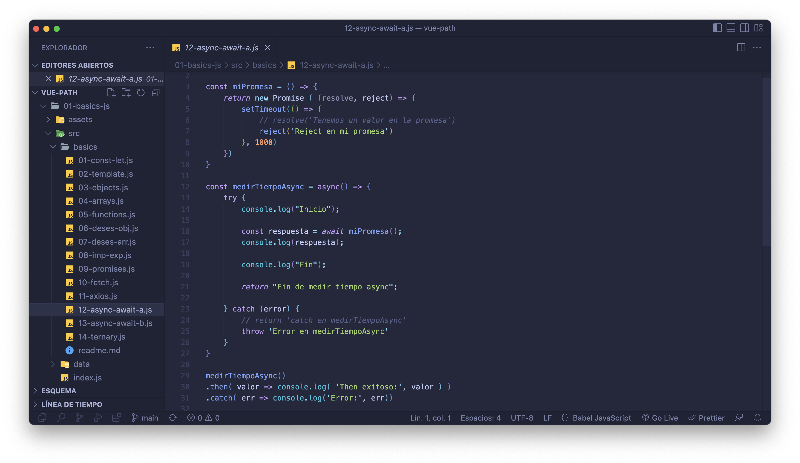

# Vue Path 

Project to strengthen the foundations of Vue; both Options and Composition Api.

There are also Javascript basics.

<a href="#top">🔝</a>

Made with ❤️ and ☕️ by Aitor Lancharro

